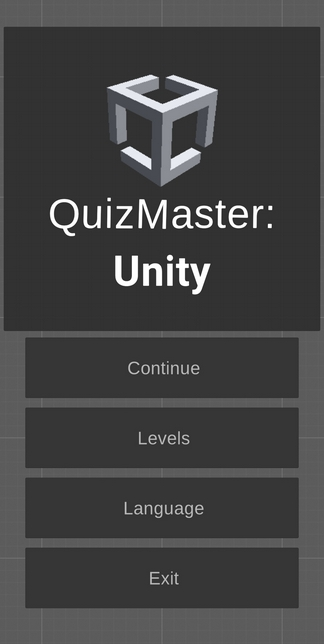
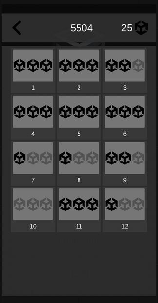
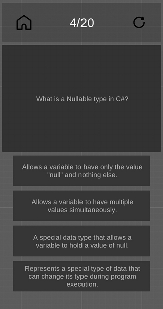
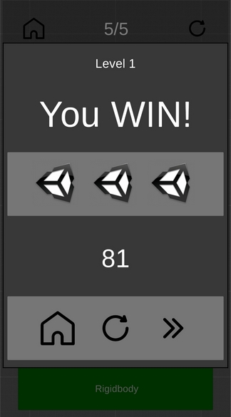

# Обучающая игра Unity Quiz.
Добро пожаловать в "Unity Quiz" - увлекательную обучающую игру, которая подготовит вас к захватывающей карьере Unity разработчика!

Собеседования на должность Unity Developer могут быть сложными, но с этой игрой
вы можете подготовиться к ним легко и увлекательно. 
В игре содержится более 150 вопросов, которые часто встречаются на собеседованиях 
и тестах, которые готовят HR. Я подобрал самые важные и интересные вопросы, 
чтобы помочь вам освоить основы разработки на Unity3D.

Каждый вопрос сопровождается развернутым объяснением, которое вы увидите, если дадите неверный ответ. 
Учебный процесс становится более эффективным, когда вы понимаете свои ошибки и учитесь на них!

"Unity Quiz" - полностью бесплатное приложение, разработанное без коммерческих целей. 
Я создал его для своего портфолио и чтобы помочь начинающим разработчикам успешно проходить собеседования. 
Моя главная цель - поддержать учебное сообщество и поделиться знаниями со всеми, кто искренне стремится учиться и развиваться.

Присоединяйтесь к "Unity Quiz" и станьте уверенным Unity Developer, готовым к любым вызовам, которые могут встретиться вам на вашем пути к успеху!

## Скриншоты игры:

## Установка:

1. Перейдите на страничку игры в Google Play.
2. Установите игру.

## Использование:

- В главном меню при нажатии "Продолжить" начинается новая игра или продолжается старая.
- На экране "Уровни" вы можете выбрать для прохождения нужный уровень. Сложность вопросов увеличивается на каждом уровне. Новые уровни открываются с прохождением предыдущих.
- При нажатии на "Язык" меняется язык интерфейса и вопросов.
- Во время прохождения викторины нужно выбрать один верный ответ из 4х. При выборе неверного ответа будет показан экран с подробным описанием правильного ответа. В конце уровня снимается по одной звезде за каждую ошибку.

## API:

## GameManager:

Класс GameManager является основным контроллером игры, отвечающим за 
управление игровым процессом, и поведение игры.

### Поля

- `uiManager`: объект, отвечающий за управление UI.
- `questionManager`: менеджер, отвечающий за предоставление нужного вопроса.
- `gameData`: ScriptableObject, в котором хранится баланс игры.

## LevelsGameData:

LevelsGameData - это ScriptableObject, предназначенный для хранения данных о 
балансе игры на различных уровнях. Этот класс содержит информацию о 
сложности каждого уровня, количестве вопросов на уровне, статусе уровня 
(открыт или заблокирован) и количество звезд, которые заработаны на каждом уровне.

### Поля

- `levels`: лист настроек для каждого уровня.
- `globalScore`: Количество очков, набранное во всех уровнях.
- `globalStars`: Количество звезд, набранное во всех уровнях.
- `currentLevelID`: ID актуального уровня.
- `currentLang`: Язык пользователя.
- `questionsFilesDict`: Словарь с файлами вопросов для викторины на разных языках.
- `langFile`: Файл локализации.

## QuestionManager:

QuestionManager - это класс, отвечающий за управление вопросами в игре. 
Он отвечает за загрузку вопросов, их обработку, подбор листа вопросов согласно балансу,
выдачу списка вопросов по требованию .

### Методы

- `GetQuestions()`: Передает весь список вопросов конкретного уровня.
- `LoadQuestionsFromFile()`: Производит загрузку вопросов из файла согласно текущей локали.

___
## Контакты:
[LinkedIn: **ryabchenko**](https://www.linkedin.com/in/ryabchenko)  
[Telegram: **whyv2**](https://t.me/whyv2)    
[Email: **00bl@bk.ru**](mailto:00bl@bk.ru)
